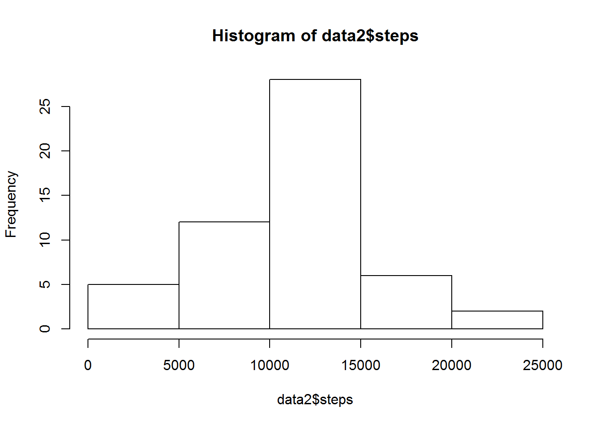
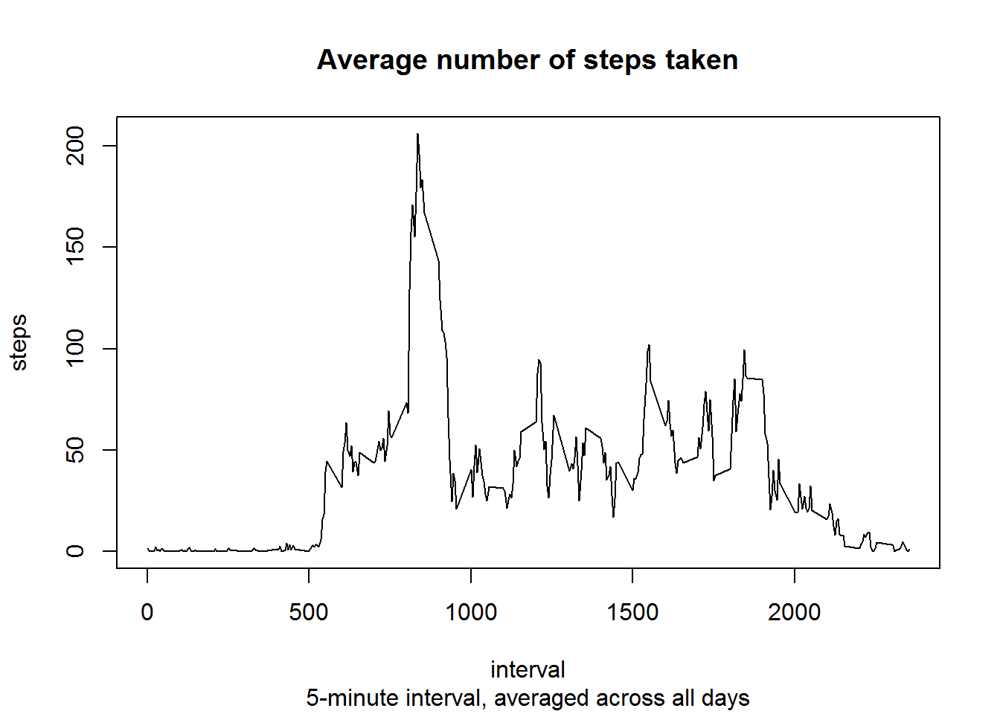
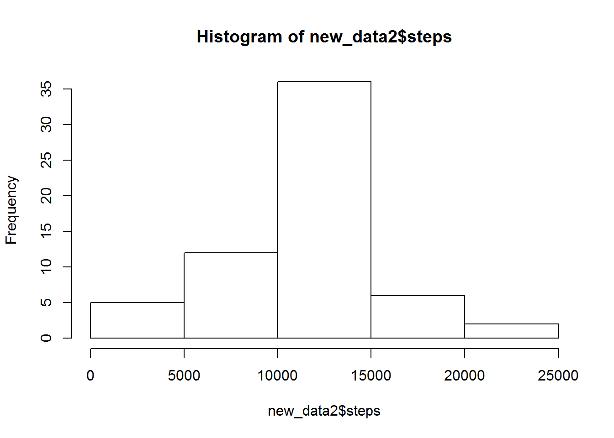
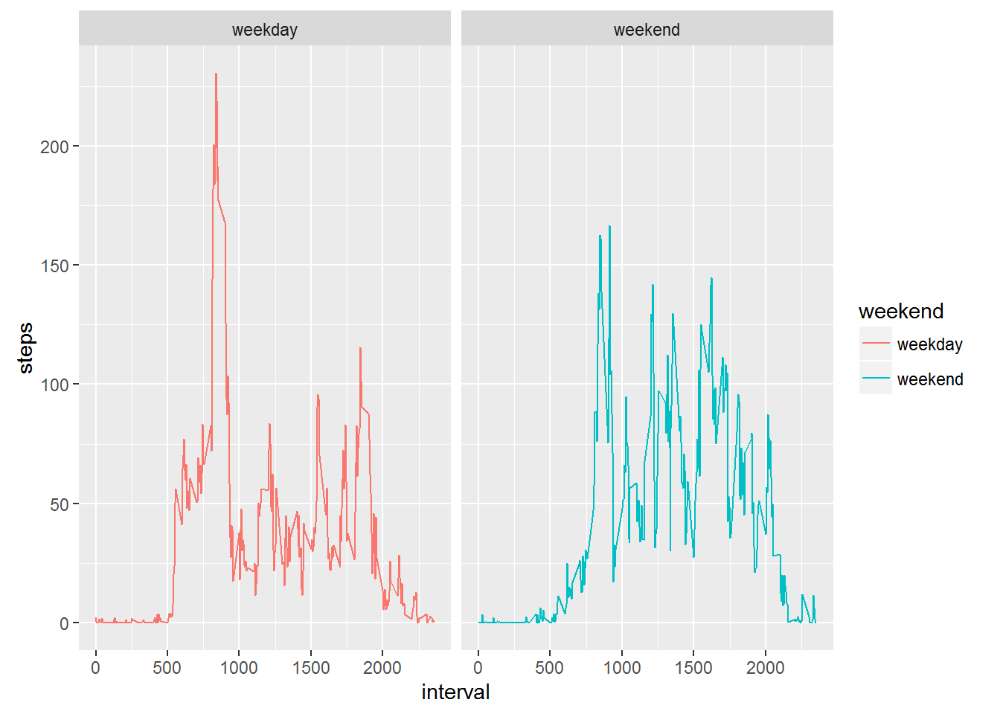

##Load the data

```r
data <- read.csv("activity.csv", header=TRUE)
```

##Preprocess the data.  Change date to datetime type.

```r
data$date <- as.Date(data$date, "%Y-%m-%d")
```

##Make a histogram of the total number of steps taken each day

```r
data2 <- aggregate(steps ~ date, data, sum)
hist(data2$steps)
```




##What is mean total number of steps taken per day?

```r
cat("mean:", mean(data2$steps))
```

```
## mean: 10766.19
```

```r
cat("median:",median(data2$steps))
```

```
## median: 10765
```

##What is the average daily activity pattern?

```r
data_5 <- aggregate(steps ~ interval, data, mean, na.action = na.omit)
plot(steps ~ interval, data_5, type="l", main="Average number of steps taken", sub="5-minute interval, averaged across all days")
```




Which 5-minute interval, on average across all the days in the dataset, contains the maximum number of steps?

```r
data_5[data_5$steps == max(data_5$steps),]
```

```
##     interval    steps
## 104      835 206.1698
```

##Imputing missing values
Calculate the total number of missing values in the dataset (i.e. the total number of rows with NAs).


```r
sum(!complete.cases(data))
```

```
## [1] 2304
```

```r
summary(data)
```

```
##      steps             date               interval     
##  Min.   :  0.00   Min.   :2012-10-01   Min.   :   0.0  
##  1st Qu.:  0.00   1st Qu.:2012-10-16   1st Qu.: 588.8  
##  Median :  0.00   Median :2012-10-31   Median :1177.5  
##  Mean   : 37.38   Mean   :2012-10-31   Mean   :1177.5  
##  3rd Qu.: 12.00   3rd Qu.:2012-11-15   3rd Qu.:1766.2  
##  Max.   :806.00   Max.   :2012-11-30   Max.   :2355.0  
##  NA's   :2304
```

Filling in all of the missing values in the dataset.
Using the mean for that 5-minute interval.

```r
missing <- data[!complete.cases(data),]

temp <- merge(missing, data_5, by="interval",all.x=T)
colnames(temp) <- c("interval", "tmp", "date", "steps")

new_data <- rbind(data[complete.cases(data),c("steps", "date", "interval")], temp[,c("steps", "date", "interval")])
```

A histogram of the total number of steps taken each day. 

```r
new_data2 <- aggregate(steps ~ date, new_data, sum)
hist(new_data2$steps)
```



Calculate the mean and median total number of steps taken per day.

```r
cat("mean:", mean(new_data2$steps))
```

```
## mean: 10766.19
```

```r
cat("median:",median(new_data2$steps))
```

```
## median: 10766.19
```

Are these values different from the estimates from the first part of the assignment?

```r
#Average
if (mean(new_data2$steps) != mean(data2$steps)) {
  print("mean changed")
} else {
  print("mean did not change")
}
```

```
## [1] "mean did not change"
```

```r
#Median
if (median(new_data2$steps) != median(data2$steps)) {
  print("median changed")
} else {
  print("median did not change")
}
```

```
## [1] "median changed"
```

What is the impact of imputing missing data on the estimates of the total daily number of steps?

```r
cat("Imputing missing data changed the sum of total daily number of steps by:",sum(new_data2$steps, na.rm = T) - sum(data2$steps, na.rm = T))
```

```
## Imputing missing data changed the sum of total daily number of steps by: 86129.51
```


## Are there differences in activity patterns between weekdays and weekends?

```r
require(ggplot2)

new_data$weekend <- ifelse(weekdays(new_data$date) %in% c("Saturday", "Sunday"), "weekend", "weekday")

data_weekend <- aggregate(steps ~ interval + weekend, new_data, mean, na.action = na.omit)

ggplot(data=data_weekend, aes(x=interval, y=steps, color=weekend), main="Average number of steps taken") + facet_wrap(~weekend) + geom_line()
```


